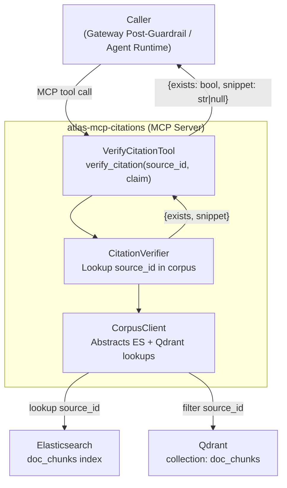

# Component Diagram — atlas-mcp-citations (C4 Level 3)

Internal components of the `atlas-mcp-citations` MCP server and their dependencies.

```mermaid
flowchart TD
    Caller["Caller\n(Gateway Post-Guardrail / Agent Runtime)"]

    subgraph MCP_Server["atlas-mcp-citations (MCP Server)"]
        VerifyCitationTool["VerifyCitationTool\nverify_citation(source_id, claim)"]
        CitationVerifier["CitationVerifier\nLookup source_id in corpus"]
        CorpusClient["CorpusClient\nAbstracts ES + Qdrant lookups"]
    end

    Elasticsearch["Elasticsearch\ndoc_chunks index"]
    Qdrant["Qdrant\ncollection: doc_chunks"]

    Caller -->|"MCP tool call"| VerifyCitationTool
    VerifyCitationTool --> CitationVerifier
    CitationVerifier --> CorpusClient
    CorpusClient -->|"lookup source_id"| Elasticsearch
    CorpusClient -->|"filter source_id"| Qdrant
    CitationVerifier -->|"{exists, snippet}"| VerifyCitationTool
    VerifyCitationTool -->|"{exists: bool, snippet: str|null}"| Caller
```
