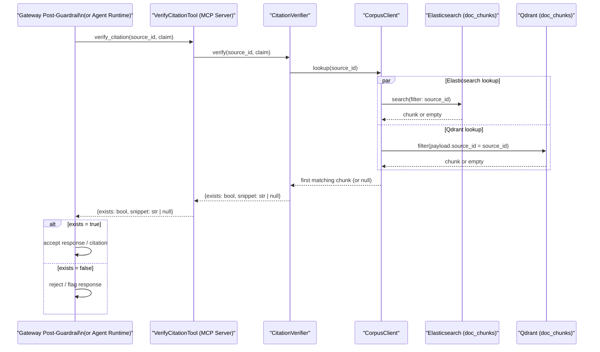

# Sequence Diagram — verify_citation Flow

End-to-end flow for a `verify_citation` call from gateway post-guardrail or agent runtime.

```mermaid
sequenceDiagram
    participant PostGuardrail as "Gateway Post-Guardrail\n(or Agent Runtime)"
    participant Server as "VerifyCitationTool (MCP Server)"
    participant Verifier as "CitationVerifier"
    participant Corpus as "CorpusClient"
    participant ES as "Elasticsearch (doc_chunks)"
    participant Qdrant as "Qdrant (doc_chunks)"

    PostGuardrail->>Server: verify_citation(source_id, claim)
    Server->>Verifier: verify(source_id, claim)
    Verifier->>Corpus: lookup(source_id)

    par Elasticsearch lookup
        Corpus->>ES: search(filter: source_id)
        ES-->>Corpus: chunk or empty
    and Qdrant lookup
        Corpus->>Qdrant: filter(payload.source_id = source_id)
        Qdrant-->>Corpus: chunk or empty
    end

    Corpus-->>Verifier: first matching chunk (or null)
    Verifier-->>Server: {exists: bool, snippet: str | null}
    Server-->>PostGuardrail: {exists: bool, snippet: str | null}

    alt exists = true
        PostGuardrail->>PostGuardrail: accept response / citation
    else exists = false
        PostGuardrail->>PostGuardrail: reject / flag response
    end
```
